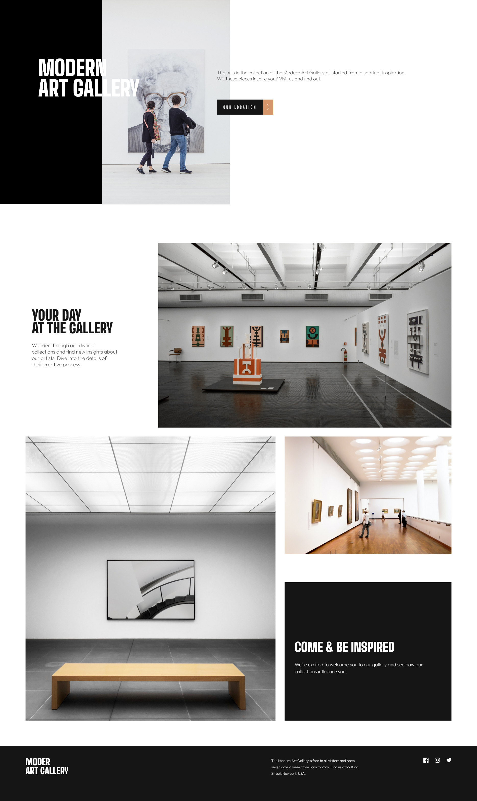

<h1 align="center" style="color: #0366d6;">
   HTML & CSS-MODERN-ART-GALLERY
</h1>

Repositorio ficticio de una galería de arte.

## Descripción 📝

Proyecto realizado exclusivamente con HTML, CSS y SASS para la colocación de elementos en estos lenguajes. Página responsive en pantalla, Tablet y Móvil.

## Vista previa en vivo 👀
Puedes ver los ejercicios funcionando aquí:  
🔗 [https://github.com/Oconcejero/HTML-CSS-MODERN-ART-GALLERY/](https://oconcejero.github.io/HTML-CSS-MODERN-ART-GALLERY/)

Puedes ver una vista previa en vivo del encabezado 
